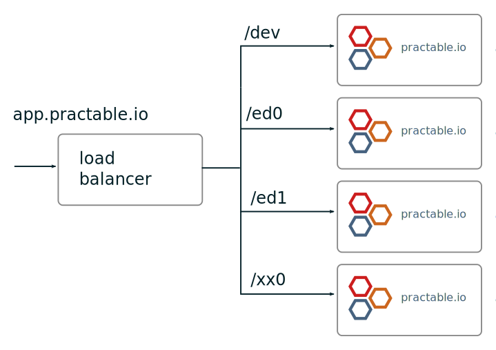
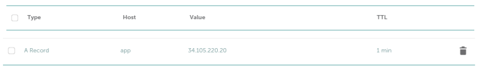
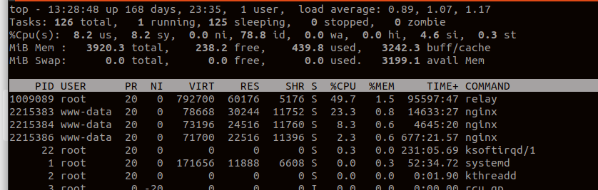

# admin-tools

This repo contains documentation and scripts for setting up and operating the official practable.io cloud service. The primary audience for this document is the core developer and operations team. Although experienced system administrators may use this guide to inform their own instantiation of a practable instance(s). For hints/tips/variations, see notes marked with a user symbol like this:

***

 

Some hints or advice for setting up a stand-alone instance or potential enhancements to our current approach. Please consider submitting pull requests with  documentation improvements, e.g. where we have missed something you had to work out / look up / ask us.

***

## README Contents

- Repo contents
- Network / service architecture
- Provisioning (on Google Compute Platform)
- Installing & Administering Practable services

If you already have a working instance, then skip to the installation/administration guides for each instance here:

-  [dev](./dev/README.md)
-  [ed0](./ed0/README.md)

## Repo Contents

The configuration and tools for each instance are held in separate directories, to minimise accidental operations on the wrong instance (a. 

```
├── dev: setup and admin tools for the development instance `dev`
├── ed0: setup and admin tools for the production instance `ed0` 
└── img: images for README.md
```

Organising the files in this way has some small advantages

- safety
    -  any operations are performed on the instance associated with your current working directory
    -  this avoids inadvertently running a playbook on the wrong instance e.g. by using command line history incorrectly
- convenience
    -  we can modify the development server configuration, scripts and tools without being constrained by the production version
	-  differences between instances can be determined via diff operation, e.g. on the configuration script

***

 

To set up your own instance, then

-  fork this repo
-  copy the `ed0` directory (the production instance) and give it a meaningful name 
-  edit the configuration script in your new directory
-  generate your files by using the configuration script

If you intend to develop new admin tools, please open an issue so we can discuss, and consider submitting a PR with the tool in either the `dev` / `ed0` directories as appropriate.

***


## Architecture 

Setting up a practable instance, or instances, requires a considerable amount of user-supplied information about experiments, user-interfaces, intended users and the policies they can book under. This section provides an overview of the system so as to help make sense of what information is required, why, and how it all comes together.

This section provides an overview of 

-  the network configuration to run multiple instances (or just one)
-  the services running on each instance
-  locations for user-configured/provided files such as experiment manifests
-  how user interface files are hosted 
-  experiment configuration (briefly)

### Network configuration

The apex domain [practable.io](https://practable.io) is used for our marketing pages, which are served by [github.io](https://github.com/practable/practable.github.io). 

Each official practable instance is served at a separate path under the `app` subdomain, following good practice examples described [here](https://www.shortcut.com/blog/building-a-saas-app-you-should-probably-stick-to-a-single-subdomain) to avoid [issues](https://www.reddit.com/r/rails/comments/lidwap/realworld_possible_issues_with_subdomain), and simplify `ssl` certificate management. 


|  |
|:--:| 
| *Practable instances served at different paths on `app` subdomain* - note only `dev` and `ed0` exist at present |


We anticipate running more than one instance for an organisation in future, with a proposed naming scheme of `xxN`. Each instance will be allocated a sub-set of the experiments to manage exclusively. Managing a large number of experiments, across multiple instances can be supported by allocating one of the instance's booking systems to manage all the bookings, although this requires [further testing](https://github.com/practable/book/issues/23). We include a `dev` instance (possibly on a smaller virtual machine) for core-code development and testing.


***

 

Your instance MUST have a public ipv4 address, or else the experiments and users will not be able to contact it. Your load balancer set up - or whether you even need one - will depend on how and where your instance is hosted. A single instance can be hosted at its own sub-domain without needing a load-balancer (e.g. `practable.your-domain.org`). To do something similar, obtain control of a domain and create an appropriate A Record in your domain name registrar's advanced DNS management tool (or make similar arrangements with the owner of a domain that you wish to use). It can take several hours or more for the DNS entry to propagate, so set this up as soon as you can. During development, you can set a short TTL, so that any changes to the IP address propagate relatively quickly, e.g. to allow you to change virtual machines. 

|  |
|:--:| 
| *Example of an A-record for the `app` subdomain* |

There are many parts of the configuration of the `practable.io` services that need to know the sub-domain they are being served at, with it affecting at least:

-  ssl certificate setup using let's encrypt
-  nginx configuration for reverse-proxying to the internal services
-  book, relay and jump configuration (they need to know the `audience` to expect in JWT tokens)
-  booking and experiment user interface base paths (requires rebuild of each user interface)
-  manifest (must have correct links for the data & video streams, and user interfaces)
-  possibly other parts of the configuration (TODO - update as develop this doc)
-  experiment configuration, including tokens (must have correct `audience`)

Changing the sub-domain is not trivial, so it is best to choose an acceptable value before you start.

***
### Instance services

There are four main services running on a single instance

-  book
-  relay
-  jump
-  static

There are some additional services currently under development

-  status (are experiments online?)
-  quality (are they passing tests?)

#### Book

Manages bookings for experiments and users - needs to know about experiments, and booking policies (via manifest file that is uploaded to the server via an API). Signs JWT tokens for users with a secret string configured by environment variable.

#### Relay

Securely connects users with the video and data streams from experiments, for the duration of the bookings. Needs to know the booking system secret to validate JWT tokens.

#### Jump

Securely connects administrators with experiments via `ssh`. Has a secret that is used to sign JWT tokens to permit experiments and administrators access. Should be different to the booking secret.

#### Static

Static file serving, for user interfaces for the booking system, and experiments. Usually provided as part of the `nginx` reverse proxy. 

***

 

Our configuration involves being able to pull from a github repo on demand. If you have multiple developers, it would be preferable to have separate repos for each, and to consider moving closer to a git-ops model, so that pushing to the repo is sufficient to trigger an update. For now, we run ansible to update the static files from the repo.

***

### Instance sizing

We were running a lower load than usual when I took this screen shot (around 20 pendulums offline due to some hardware upgrades) - however with 65 incoming video feeds, the load on our GCE instance is about 0.75 CPU. Testing indicates outgoing video feeds to users are about /10th the load of the incoming feed, so there is plenty of headroom for taking on users. Out of term time, our dashboard recently recommended we drop to e2-custom-2-3328 with 2 vCPU and 3.25GB RAM. Golang can spread work across multiple CPU so the `relay` service can exceed 1.0 CPU so long as there is spare capacity to do so.

|  |
|:--:| 
| *`top` for our GCE instance (e2-highcpu-4 with 4 vCPU & 4GB RAM) with 65 incoming video streams* |

***

 

These requirements may increase if you have many experiments, and as the system develops further. For example, we expect to add a requirement for database support in future.

***


### Experiment configuration

Setting up a typical experiment involves preparing JWT tokens for the video and data connections to the `relay` service and the admin connection to the `jump` service. An experiment can connect to multiple instances if so desired, e.g. to support active-passive failover, but only one instance should be permitted to handle the booking of an experiment (to avoid users on different instances booking at the same time, and colliding).

There is more information on experiment configuration in the repos for our existing experiments. At present, these configurations reflect the system in use at the time of the installation of the experiments, and so the scripts represent a varying degree of maturity. 

TODO - update this document with a link to a repo that represents a good example.

## Provisioning (on Google Compute Platform)

Our system does not rely on any particular cloud provider features, so theoretically it can run on any provider that will give you VMs with a few CPU and few GB of RAM, a public IPv4 address, firewall with open ports for incoming 443/tcp and 22/tcp, and root access, as well as some form of load balancer if you need one. Issues we have encountered with some suppliers of cloud compute services include lack of (a) root access, (b) public IPv4, (c) convenient tooling for provisioning. 

### instances

Create these before the unmanaged instance groups

for dev: 

Create a VM

-  name: instance-app-practable-dev
-  region: europe-west2 (london)
-  zone: europe-west2-c
-  series: e2
-  e2-small (2 vCPU, 2 GB memory)
-  boot disk
    - operating system:  ubuntu
	- version: Ubuntu 20.04 LTS
	- boot disk type: balanced persistent disk
	- size: 10GB
	- advanced configuration
	    -  deletion rule: keep boot disk
		-  the rest default
-  identity and API access
    -  service accounts: Compute Enginer default service account
	-  access scopes: allow default access
	-  firewall: allow http (else load balancer can't pass traffic)
-  Advanced options (leave as default)

For ed0

-  name: instance-app-practable-dev
-  region: europe-west2 (london)
-  zone: europe-west2-c
-  series: e2
-  e2-custom-3328 (2 vCPU, 3.25 GB GB memory, $51.17/monthly )
-  boot disk
    - operating system:  ubuntu
	- version: Ubuntu 20.04 LTS
	- boot disk type: balanced persistent disk
	- size: 10GB
	- advanced configuration
	    -  deletion rule: keep boot disk
		-  the rest default
-  identity and API access
    -  service accounts: Compute Enginer default service account
	-  access scopes: allow default access
	-  firewall: allow http (else load balancer can't pass traffic)
-  Advanced options (leave as default)
	

### Instance groups

These have to be created before the load balancer can be configured, because of the backend configuration step in the load balancer 

Create instance group (New unmanaged instance group) for dev

-  name: instance-group-app-practable-dev
-  description:Instance group for backend of app.practable.io/dev
-  region: europe-west2 (london)
-  zone: europe-west2-c
-  network: default
-  subnetwork: default
-  VM Instances
    -  select VMs: instance-app-practable-dev
-  Port mapping:
    -  port name 1: http
	-  port numbers 1: 80


Create instance group (New unmanaged instance group) for ed0

-  name: instance-group-app-practable-ed0
-  description:Instance group for backend of app.practable.io/ed0
-  region: europe-west2 (london)
-  zone: europe-west2-c
-  network: default
-  subnetwork: default
-  VM Instances
    -  select VMs: instance-app-practable-ed0
-  Port mapping:
    -  port name 1: http
	-  port numbers 1: 80


### Load Balancer

- Application load balancer (HTTP/S)
- From internet to my VMs or serviceless services
- Regional external Application Load Balancer (recommended for Standard Network Tier)
- name: app-practable-load-balancer
- region: europe-west2 (London)
- network: default
- proxy-only subnet 
    -  name: app-practable-proxy-only-subnet
	-  ip address range: 10.0.0.0/24
- Frontend Configuration
    - name app-practable-https-port
	- Protocol: HTTPS( includes HTTP/2)
	- Port: 443
    - create new static IP address
        - name: app-practable-external-ip
    	- description: External IP for app-practable load balancer	
    - create ssl cert using cert and private key from let's encrypt 
        -  name wildcard-practable-ssl-lets-encrypt
    	-  description Let's encrypt ssl wildcard practable.io
    	- add cert from `~/sources/admin-tools-legacy/aws/ssl/tmp/live/practable.io/fullchain.pem`
    	- add key from `~/sources/admin-tools-legacy/aws/ssl/tmp/live/practable.io/privkey.pem`
        -  (TODO - how to update when expired?)
     -  Additional certificates: just leave as GCP default		
- Backend configuration
    -  Create backend service
	    -  name: app-practable-dev-backend-service
		-  description: backend service for app.practable.io/dev
		-  backend type: instance group
		-  protocol: http
		-  named port: http
		-  timeout: 30 sec (default)
		-  New Backend
		    -  instance group: instance-group-app-practable-dev
			-  port numbers: 80
			-  balancing mode : utlization
			-  Create Health Check
			    -  name: app-practable-dev-health-check
				-  description: health check for app.practable.io/dev backend service
				-  region is set already and uneditable
				-  protocol: http
				-  port: 80
				-  proxy protocol: NONE
				-  request path: `/dev/` #note default / makes nginx config difficult for vue routing
				-  logs: off
				-  health criteria: leave as default
    -  Create backend service
	    -  name: app-practable-ed0-backend-service
		-  description: backend service for app.practable.io/ed0
		-  backend type: instance group
		-  protocol: http
		-  named port: http
		-  timeout: 30 sec (default)
		-  New Backend
		    -  instance group: instance-group-app-practable-ed0
			-  port numbers: 80
			-  balancing mode : utlization
			-  Create Health Check
			    -  name: app-practable-ed0-health-check
				-  description: health check for app.practable.io/ed0 backend service
				-  region is set already and uneditable
				-  protocol: https
				-  port: 443
				-  proxy protocol: NONE
				-  request path: `/ed0` #note default / makes nginx config difficult for vue routing
				-  logs: off
				-  health criteria: leave as default        	
 
- Routing Rules
    - Rule 1
	    -  Host 1: (empty, must handle anything else) 
		-  Path 1: (empty, must handle anything else) 
		-  Backend 1: app-practable-ed0-backend-service
	-  Rule 2: 
	    -  Host 2: app.practable.io
	    -  Path 2: /dev/*
	    -  Backend 2: app-practable-dev-backend-service
	-  Rule 3: 
	    -  Host 3: app.practable.io
	    -  Path 3: /ed0/*
	    -  Backend 3: app-practable-ed0-backend-service	
		

### Update DNS 

Update the A-record for `app` in the domain name registrar's advanced DNS management tool for `practable.io` to the ip address of the load balancer (35.214.88.15).

Check the frontend is alive and externally findable

```
$ openssl s_client -connect app.practable.io:443 2>/dev/null | openssl x509 -noout -dates

notBefore=Jun 27 20:20:48 2023 GMT
notAfter=Sep 25 20:20:47 2023 GMT

```

This shows the load balancer is up and running. 

To ssh into the instances:
```
gcloud compute ssh --zone "europe-west2-c" "instance-app-practable-dev"  --project "some-project-000000"
```
```
gcloud compute ssh --zone "europe-west2-c" "instance-app-practable-ed0"  --project "some-project-000000"
```
If you get the standard `ssh` login, then they are up and running. In GCP dashboard, the new instances are failing the health checks we created because there is no web service setup on them. We install the services in the next step.

### Set up ansible for use with the project 

Ansible support is [described here](https://docs.ansible.com/ansible/latest/scenario_guides/guide_gce.html)

```
$ pip install requests google-auth
```

As per [doc]((https://docs.ansible.com/ansible/latest/scenario_guides/guide_gce.html) In GCP console, Select the project, service account, then go the keys tab and download a JSON key

Then add to `/etc/ansible/ansible.cfg` the following (must include all the default plugins to still be able to parse the standard hosts file)

```
[defaults]
inventory      = /opt/ansible/inventory/gcp.yaml

[inventory]
enable_plugins = gcp_compute, host_list, script, auto, yaml, ini, toml 
```

We want to define groups that we can run playbooks against. We can do that by creating`/opt/ansible/inventory/gcp.yaml` and using the instance name, although there are other options such as tags if there are multiple instances in each group ([more info](https://devopscube.com/ansible-dymanic-inventry-google-cloud/)) 


```
plugin: gcp_compute
projects:
  - healthy-reason-375613
auth_kind: serviceaccount
service_account_file: /home/tim/healthy-reason-375613-970326130116.json
keyed_groups:
  - key: labels
  - prefix: label
groups:
  app_practable_dev: "'instance-app-practable-dev' in name"
  app_practable_ed0: "'instance-app-practable-ed0' in name"
  
```

```
$ ansible-inventory --list 
<returns info on the instances in json format>
```


```
$ ansible-inventory --graph 
@all:
<snip>
  |--@app_practable_dev:
  |  |--34.147.137.222
  |--@app_practable_ed0:
  |  |--34.142.59.89
<snip>
```


```
$  ansible app-practable-dev -m ping
34.147.137.222 | SUCCESS => {
    "ansible_facts": {
        "discovered_interpreter_python": "/usr/bin/python3"
    },
    "changed": false,
    "ping": "pong"
}
$ ansible app_practable_ed0 -m ping  
34.142.59.89 | SUCCESS => {
    "ansible_facts": {
        "discovered_interpreter_python": "/usr/bin/python3"
    },
    "changed": false,
    "ping": "pong"
}
```

## Installing practable services

See the README.md for each instance's installation & administration tools here:

-  [dev](./dev/README.md)
-  [ed0](./ed0/README.md)


## Appendix


### Original README.md for admin-tools

This repo contains scripts to help administer our two currently-running systems.

- aws (running on relay v0.2.3 with instant-use non-cancellable bookings)
- gce-develop (running latest relay with advance, cancellable bookings)

The tools for each system are in a different repo, because they have different pre-requisites.

## Setup

### Practable binaries

Clone the repo, then run the install scripts for each system

```
cd aws
./install.sh
cd ../gce-develop
./install.sh
```

This will install the correct version of the practable binaries for interacting with each system.

### Other pre-requsites

There are additional pre-requisites you may need to install, depending on which system(s) you are using.


- [jq](https://stedolan.github.io/jq/)
- [websocat](https://github.com/vi/websocat)
- [mo](https://github.com/tests-always-included/mo)
- [relay](https://github.com/practable/relay)
- [yq](https://github.com/mikefarah/yq)


## Overview

We currently run a fleet of 129 experiments

10 x gen 1 spinners (on hold)
10 x gen 1 turners (on hold)
10 x gen 1 governors (on hold)
48 x gen 2 spinners (spin30-77)
32 x gen 1 pendulums (pend00-40, with some loaned to other locations)
8 x medium trusses (trus00-08)
5 x pocket VNA one-port (pvna00-04)
6 x pocket VAN two-port (pvna05-10)

All experiments use the AWS system's shellrelay for administrative access. Some experiments connect only to the shellrelay2, some connect to shellrelay as well
All gen 2 spinners and gen 1 pendulums send video and data to both systems, but are currently only bookable on the gce-develop system.
All trusses and pvna are bookable through the aws system only.

It is intended to migrate all experiments to have their data and video directed only to the new system, and retire the sessionrelay and bookrelay service on aws, but keep the shellrelay (for the time being).

## System status

### Experiment health

See what is connected using `./aws/shellrelay/identify2.sh`

## Experiment video and data connections

Check what is connected and streaming using the `./gce-develop/relay/getStats.sh` or `./aws/sessionrelay/getSessionStats.sh` scripts, depending which system is of interest.

## Manifest

See separate repos for manifests

[manifest-aws](https://github.com/practable/manifest-aws)
[manifest-gce-develop](https://github.com/practable/manifest-gce-develop)

## Tokens

### AWS

there are token generation scripts in `./aws/tokens`, such as `./generate` that provides a set of links starting every given interval for a given duration 


Usage:
```
generate <groups> <start_datetime> <every> <duration> <end_datetime> <code> <link_stub>
```

Example::
```
generate "truss everyone"  2022-10-05T07:00:00Z 1d 3d  2022-12-21T07:00:00Z truss22 "https://book.practable.io/?c="
```

### gce-develop


A different approach is taken where actual individual bookings are generated (or pairs or more of bookings) according to a `booking-plan.yaml`

Go to `./gce-develop/book` and edit `booking-plan.yaml` 

The format is like this:

```
---
slot_lists:
  pend:
    policy: p-engdes1-lab-pend
    slots:
    - sl-engdes1-lab-pend00
    - sl-engdes1-lab-pend02
    - sl-engdes1-lab-pend03
    - sl-engdes1-lab-pend04
    - sl-engdes1-lab-pend05
    - sl-engdes1-lab-pend06
    - sl-engdes1-lab-pend07       
    - sl-engdes1-lab-pend08
    - sl-engdes1-lab-pend09
    - sl-engdes1-lab-pend10
    - sl-engdes1-lab-pend11
    - sl-engdes1-lab-pend12
    - sl-engdes1-lab-pend13
    - sl-engdes1-lab-pend14
    - sl-engdes1-lab-pend15
    - sl-engdes1-lab-pend16
    - sl-engdes1-lab-pend17       
    - sl-engdes1-lab-pend20
    - sl-engdes1-lab-pend21
    - sl-engdes1-lab-pend22
    - sl-engdes1-lab-pend23
    - sl-engdes1-lab-pend36
    - sl-engdes1-lab-pend26
    - sl-engdes1-lab-pend27       
    - sl-engdes1-lab-pend28
    - sl-engdes1-lab-pend29
    - sl-engdes1-lab-pend31
    - sl-engdes1-lab-pend33
    - sl-engdes1-lab-pend34
    - sl-engdes1-lab-pend35
    
  spin:
    policy: p-engdes1-lab-spin
    slots: 
    - sl-engdes1-lab-spin30
    - sl-engdes1-lab-spin32
    - sl-engdes1-lab-spin33
    - sl-engdes1-lab-spin34
    - sl-engdes1-lab-spin35
    - sl-engdes1-lab-spin36
    - sl-engdes1-lab-spin37       
    - sl-engdes1-lab-spin38
    - sl-engdes1-lab-spin39
    - sl-engdes1-lab-spin40
    - sl-engdes1-lab-spin41
    - sl-engdes1-lab-spin46
    - sl-engdes1-lab-spin47       
    - sl-engdes1-lab-spin48
    - sl-engdes1-lab-spin49
    - sl-engdes1-lab-spin51
    - sl-engdes1-lab-spin52
    - sl-engdes1-lab-spin53
    - sl-engdes1-lab-spin54
    - sl-engdes1-lab-spin55
    - sl-engdes1-lab-spin56
    - sl-engdes1-lab-spin57       
    - sl-engdes1-lab-spin58
    - sl-engdes1-lab-spin59
    - sl-engdes1-lab-spin60
    - sl-engdes1-lab-spin61
    - sl-engdes1-lab-spin62
    - sl-engdes1-lab-spin63
    - sl-engdes1-lab-spin65
    - sl-engdes1-lab-spin66   
windows:
  friday-10-mar-10am-12pm:
    start: 2023-03-10T09:59:59Z
    end:   2023-03-10T12:00:01Z
  monday-13-mar-2pm-4pm:
    start: 2023-03-13T13:59:59Z
    end:   2023-03-13T16:00:01Z
  monday-13-mar-4pm-6pm:
    start: 2023-03-13T15:59:59Z
    end:   2023-03-13T18:00:01Z
  tuesday-14-mar-2pm-4pm:
    start: 2023-03-14T13:59:59Z
    end:   2023-03-14T16:00:01Z
  tuesday-14-mar-4pm-6pm:
    start: 2023-03-14T15:59:59Z
    end:   2023-03-14T18:00:01Z      
sessions:
  friday-10-mar-2023-12pm-A:
    prefix: engdes1
    suffix: pend-then-spin
    bookings:
      - start: 2023-03-10T10:10:01Z
        end:   2023-03-10T11:09:59Z
        slot_list: pend 
      - start: 2023-03-10T11:10:00Z
        end:   2023-03-10T11:59:59Z
        slot_list: spin
  friday-10-mar-2023-12pm-B:
    prefix: engdes1
    suffix: spin-then-pend
    bookings:
      - start: 2023-03-10T10:10:00Z
        end:   2023-03-10T11:09:59Z
        slot_list: spin
      - start: 2023-03-10T11:10:01Z
        end:   2023-03-10T11:59:59Z
        slot_list: pend 
  monday-13-mar-2023-2pm-A:
    prefix: engdes1
    suffix: pend-then-spin
    bookings:
      - start: 2023-03-13T14:10:01Z
        end:   2023-03-13T15:09:59Z
        slot_list: pend
      - start: 2023-03-13T15:10:00Z
        end:   2023-03-13T15:59:59Z
        slot_list: spin
  monday-13-mar-2023-2pm-B:
    prefix: engdes1
    suffix: spin-then-pend
    bookings:
      - start: 2023-03-13T14:10:00Z
        end:   2023-03-13T15:09:59Z
        slot_list: spin
      - start: 2023-03-13T15:10:01Z
        end:   2023-03-13T15:59:59Z
        slot_list: pend
  monday-13-mar-2023-4pm-A:
    prefix: engdes1
    suffix: pend-then-spin
    bookings:
      - start: 2023-03-13T16:10:01Z
        end:   2023-03-13T17:09:59Z
        slot_list: pend
      - start: 2023-03-13T17:10:01Z
        end:   2023-03-13T17:59:59Z
        slot_list: spin
  monday-13-mar-2023-4pm-B:
    prefix: engdes1
    suffix: spin-then-pend
    bookings:
      - start: 2023-03-13T16:10:01Z
        end:   2023-03-13T17:09:59Z
        slot_list: spin
      - start: 2023-03-13T17:10:01Z
        end:   2023-03-13T17:59:59Z
        slot_list: pend
  tuesday-14-mar-2023-2pm-A:
    prefix: engdes1
    suffix: pend-then-spin
    bookings:
      - start: 2023-03-14T14:10:01Z
        end:   2023-03-14T15:09:59Z
        slot_list: pend
      - start: 2023-03-14T15:10:01Z
        end:   2023-03-14T15:59:59Z
        slot_list: spin
  tuesday-14-mar-2023-2pm-B:
    prefix: engdes1
    suffix: spin-then-pend
    bookings:
      - start: 2023-03-14T14:10:01Z
        end:   2023-03-14T15:09:59Z
        slot_list: spin
      - start: 2023-03-14T15:10:01Z
        end:   2023-03-14T15:59:59Z
        slot_list: pend
  tuesday-14-mar-2023-4pm-A:
    prefix: engdes1
    suffix: pend-then-spin
    bookings:
      - start: 2023-03-14T16:10:01Z
        end:   2023-03-14T17:09:59Z
        slot_list: pend
      - start: 2023-03-14T17:10:01Z
        end:   2023-03-14T17:59:59Z
        slot_list: spin
  tuesday-14-mar-2023-4pm-B:
    prefix: engdes1
    suffix: spin-then-pend
    bookings:
      - start: 2023-03-14T16:10:01Z
        end:   2023-03-14T17:09:59Z
        slot_list: spin
      - start: 2023-03-14T17:10:01Z
        end:   2023-03-14T17:59:59Z
        slot_list: pend          
```


The above plan produces 30 pairs of bookings for each of 10 sessions, for a total of 600 bookings.

More details on how to upload these bookings (including keeping existing user bookings) is [here](./gce-develop/book/README.ms)

The booking links are provided in `gce-develop/book/data/booking-links.txt` with each line containing a description and a booking link similar to

```
engdes1-2023-Mar-14-Tue-1610-1759-spin-then-pend-029-abc123, https://dev.practable.io/book/?s=abc123
```


