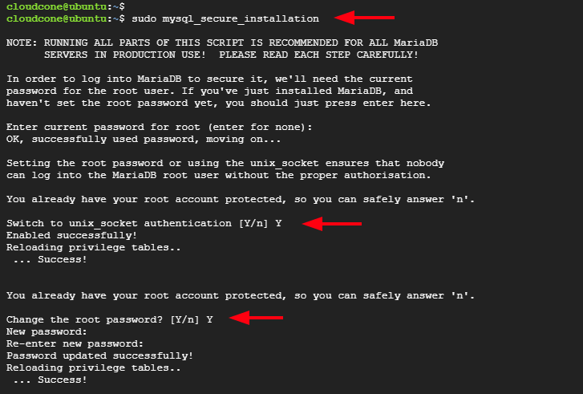
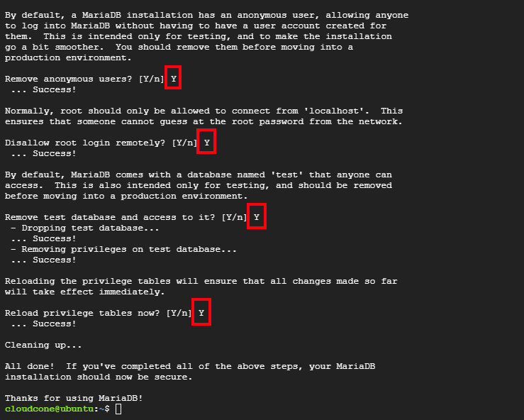

AFter running nginx and wordpress-install-prereq scripts, there are manual configuration steps as follows.

### Mariadb

#### Key info:
database: wordpress
username: wordpress
password:`$PRACTABLE_SECRETS/web.practable.io/mariadb-wordpress-user.pat`

#### Setup instructions

requires (securing against attacks](https://cloudcone.com/docs/article/how-to-install-lemp-stack-on-ubuntu-22-04/)

```
sudo mysql_secure_installation
```




The root password is in `$PRACTABLE_SECRETS/web.practable.io/mariadb-root.pat`

Create a wordpress user by starting mariadb as root

```
sudo mysql -u root -p
```

Then issuing

```
create database wordpress;
grant all privileges on wordpress.* TO 'wordpress'@'%' identified by 'password';
```

where password is the contents of `$PRACTABLE_SECRETS/web.practable.io/mariadb-wordpress-user.pat`

Check user is present:

```
SELECT user FROM mysql.user;
```

Exit back to terminal, then connect as the user to the database:
```
sudo mysql -u wordpress -p wordpress
```

There should now be an empty set of tables, which can be verified by 
```
show tables;
```

## Install wordpress

In the terminal, move to the `web` directory and login (assuming you have already run configure.sh) to the GCP instance (web-practable-io-alpha-default):

```
cd <path-to>/admin-tools/web
./login.sh
```

On the GCP instance, download the latest version of wordpress:

```
wget https://wordpress.org/latest.tar.gz
```

And then extract:

```
tar -xzvf latest.tar.gz
```

This will create a directory called wordpress.

In that directory make a copy of the `wp-config-sample.php` file and rename it `wp-config.php`:

```
cd wordpress
sudo cp wp-config-sample.php wp-config.php
```

Edit the wp-config.php file to include the database details created earlier. The authentication keys can be generated [here](https://api.wordpress.org/secret-key/1.1/salt/)

```
sudo nano wp-config.php
```

Move the contents of the wordpress folder to the location you are hosting the wordpress site e.g.:

```
sudo mv ./wordpress/* /var/www/<domain-name>/
```

You may need to make nginx the owner of that directory:

```
sudo chown -R www-data:www-data /var/www/<domain-name>
```

On a browser, start the wordpress installation by going to:

```
https://<domain-name>/wp-admin/install.php
```

And complete the details there to install wordpress.


## Install astra pro

we want to modify background colours etc, so have paid for a year of astra pro (3 Oct 2024)

This needs an addon to be uploaded, but it exceeds the default file size limit

we need to change php.ini for our php installation (not wordpress)

you can find your `php.ini` file with 

```
php -i | grep ini
```

For our initial installation that yields our location as `/etc/php/8.1/cli/php.ini`

Except that only changes the cli settings, so we need to edit `/etc/php/8.1/fpm/php.ini` instead:-

Change these lines from (other lines inbetween snipped for clarity)

```
; https://php.net/max-execution-time
max_execution_time = 30
; https://php.net/max-input-time
max_input_time = 60
; https://php.net/post-max-size
post_max_size = 8M
; https://php.net/upload-max-filesize
upload_max_filesize = 2M
```

to

```
; https://php.net/max-execution-time
max_execution_time = 300
; https://php.net/max-input-time
max_input_time = 300
; https://php.net/post-max-size
post_max_size = 256M
; https://php.net/upload-max-filesize
upload_max_filesize = 64M
```

Then restart php
```
sudo systemctl restart php8.1-fpm.service 
```
